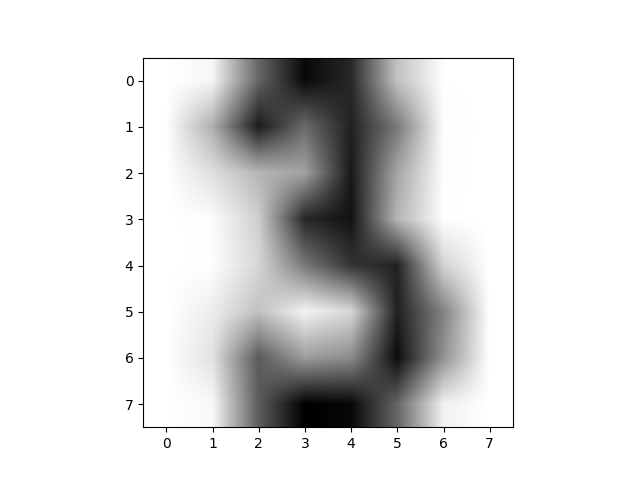
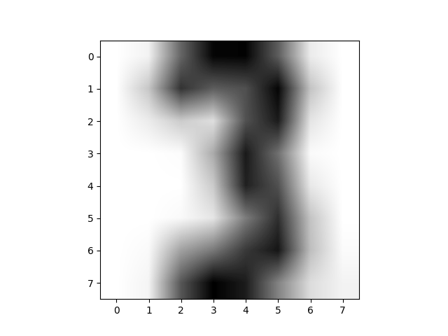
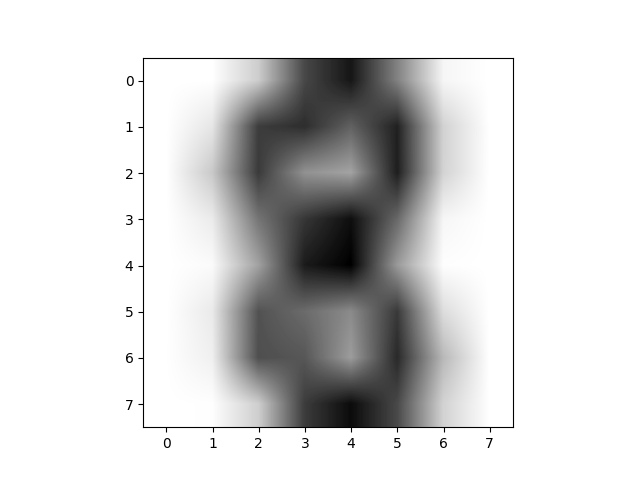

# Tarea 5 | Aglomeración

## Criterios de evaluación

Son utilizados para la evaluación de un algoritmo de agrupamiento; esto debido a que no se puede contar el número de errores o la precisión y recuperación de un algoritmo de clasificación supervisado para medir su desempeño.

Una correcta forma de medir los resultados es comparando si las agrupaciones realizadas por dichos algoritmos son similares con algún conjunto que se pueda tomar como base o "verdad". Otra modiladad para cuantificar el rendimiento es si satisface suposiciones realizadas, como la similitud de objetos dentro de una misma clase en contraste con otros de una clase distinta. Para este último, se utiliza alguna métrica de similitud elegida *apriori*.

- Puntaje de homogeneidad (homo): con el conocimiento de la verdad fundamental para la asignación en cada clase de las muestras, la homogeneidad verifica los grupos posean elementos pertenecientes únicamemte a un tipo de clase.
- Puntaje de completud (compl): utilizando una verdad fundamental como referencia,  se satisface la completud de un grupo si todos los puntos de datos que son miembros de una clase dada son elementos del mismo grupo.
- Medida V (v-meas): es la media armónica entre homogeneidad y completud.
- Índice aleatorio ajustado (ARI): se tiene conocimiento teórico del resultado de las clasificaciones de los objetos. Las predicciones realizadas por el algoritmo son analizadas con las primeras, obteniendo la similitud entre ellas e ignorando las permutaciones.
- Información mutua ajustada (AMI): Con el conocimiento de las respuestas para las clase de verdad básica y los valores obtenidos del algoritmos de agrupamiento, la información mutua es una función que mide el acuerdo de las dos asignaciones, ignorando las permutaciones.
- Coeficiente de silueta (silhouette): es una medida que no utiliza la verdad fundamental, sino medidas de datos que se obtienen del mismo modelo generado. Un valor más alto está relacionado un clusters mejores definidos.

## Modo de inicialización

Define un método de inicialización con los puntos de inicio, donde se empiezan a agrupar los clusters. Existen tres métodos:

- "K-means ++": los centros iniciales, en donde se empieza a crear los clusters utilizando k-means, son escogidos de un breve análisis de los datos para seleccionar puntos que acelerenen la convergencia.
- "Aleatorio": se eligen k muestras (filas) al azar de los datos para los centroides iniciales.
- "ndarray": debe tener forma (n_clusters, n_features), en donde se dan los centros iniciales.

## Resultados obtenidos

### Con K = 3

#### PCA
#### Valores
 

### Con K = 10
#### PCA

#### Valores

### Con K = 20

#### PCA

#### Valores

